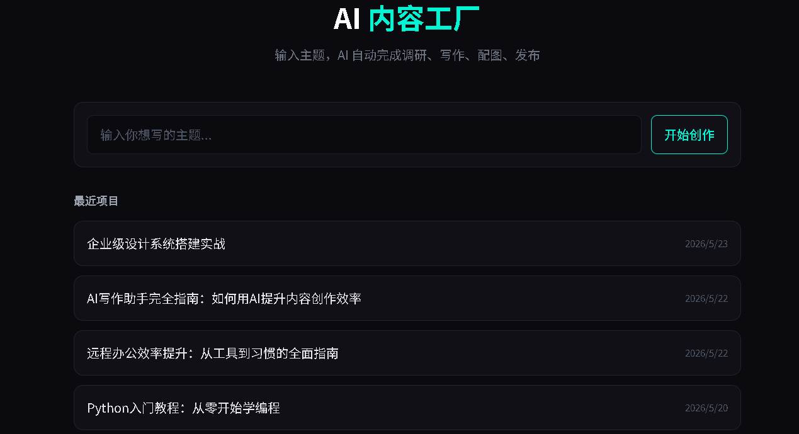
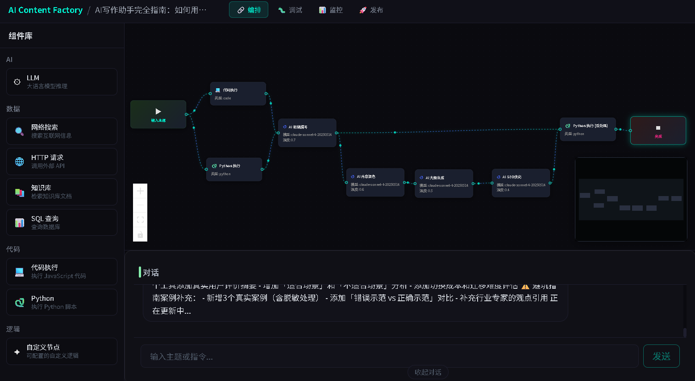

# AI Content Factory

可视化 AI 内容创作平台，支持拖拽式工作流编排、多模式切换、实时调试与多平台发布。


## 预览

### 首页 - 项目管理



### 工作台 - 可视化工作流编排



## 功能特性

### 工作流编排
- 基于 React Flow 的可视化节点编辑器
- 拖拽式组件添加（LLM、搜索、HTTP、代码执行等）
- 自定义节点配置（模型选择、参数调整、Prompt 编辑）
- 动态渐变连线与粒子动画

### 四种工作模式
- **编排** - 设计和调整 AI 工作流程
- **调试** - 查看执行日志与节点状态
- **监控** - 性能指标、节点延迟、执行记录
- **发布** - 一键发布到微信、知乎、小红书、Twitter 等平台

### 项目管理
- 创建新项目自动生成调研、大纲、初稿
- 每个项目独立的工作流配置
- 11 个预置 Demo 项目（覆盖技术、职场、设计等领域）

### AI 对话
- 基于 Claude API 的流式对话
- SSE 实时响应
- 多轮上下文记忆

## 技术栈

| 类别 | 技术 |
|------|------|
| 框架 | Next.js 14 (App Router) |
| UI | React 18 + Tailwind CSS |
| 状态管理 | Zustand |
| 工作流 | @xyflow/react (React Flow) |
| 动画 | Framer Motion |
| AI | Anthropic Claude API |
| 样式 | Glassmorphism + Neon 主题 |

## 快速开始

### 环境要求
- Node.js 18+
- npm 或 pnpm

### 安装

```bash
git clone https://github.com/bestunblockedgames/ai-content-factory.git
cd ai-content-factory
npm install
```

### 配置

创建 `.env.local` 文件：

```env
ANTHROPIC_API_KEY=your_api_key_here
```

### 启动

```bash
npm run dev
```

打开 http://localhost:3000

### 构建

```bash
npm run build
npm start
```

## 项目结构

```
ai-content-factory/
├── app/
│   ├── api/
│   │   ├── chat/route.ts          # SSE 流式对话
│   │   ├── project/
│   │   │   ├── list/route.ts      # 项目列表 & 创建
│   │   │   └── [id]/route.ts      # 项目详情
│   │   └── stages/[stage]/route.ts
│   ├── project/[id]/page.tsx      # 项目工作台
│   ├── page.tsx                   # 首页
│   ├── layout.tsx
│   └── globals.css
├── components/
│   ├── workflow/
│   │   ├── WorkflowEditor.tsx     # React Flow 画布
│   │   ├── ToolPalette.tsx        # 左侧工具栏
│   │   ├── ConfigPanel.tsx        # 右侧配置面板
│   │   ├── nodes/                 # 自定义节点
│   │   │   ├── StartNode.tsx
│   │   │   ├── EndNode.tsx
│   │   │   ├── LLMNode.tsx
│   │   │   ├── ToolNode.tsx
│   │   │   └── index.ts
│   │   ├── edges/
│   │   │   └── AnimatedEdge.tsx   # 动态连线
│   │   └── views/
│   │       ├── DebugView.tsx      # 调试视图
│   │       ├── MonitorView.tsx    # 监控视图
│   │       └── PublishView.tsx    # 发布视图
│   ├── layout/
│   │   ├── Navbar.tsx
│   │   └── TopBar.tsx
│   ├── chat/                      # 对话组件
│   ├── preview/                   # 预览组件
│   └── ui/                        # 基础 UI 组件
├── store/
│   └── useWorkflowStore.ts        # Zustand 状态管理
├── types/
│   ├── index.ts                   # 基础类型
│   └── workflow.ts                # 工作流类型
├── lib/
│   ├── ai.ts                      # Claude API 封装
│   ├── storage.ts                 # 本地文件存储
│   └── stages.ts                  # 流程编排
└── data/
    └── projects/                  # 项目数据 (JSON)
```

## 工作模式说明

### 编排模式
可视化编辑 AI 工作流程，支持拖拽添加节点、连线、配置参数。

### 调试模式
实时查看工作流执行日志，每个节点的运行状态和耗时统计。

### 监控模式
查看项目级性能指标：执行次数、成功率、平均耗时、Token 消耗、节点延迟分布。

### 发布模式
选择目标平台（微信公众号、知乎、小红书、Twitter），一键格式化并发布内容。

## Demo 项目

系统预置 11 个示例项目，涵盖不同领域和阶段：

| 项目 | 阶段 | 话题 |
|------|------|------|
| ChatGPT 职场效率 | 已发布 | AI 办公技巧 |
| React 性能优化 | 初稿中 | 前端性能调优 |
| Docker 部署实战 | 大纲中 | 容器化部署 |
| 微信小程序电商 | 配图中 | 小程序开发 |
| SQL 性能调优 | 已发布 | 数据库优化 |
| TypeScript 类型体操 | 调研中 | 高级类型 |
| AI 绘画工具横评 | 初稿中 | AI 工具对比 |
| Python 入门教程 | 已发布 | 编程入门 |
| 远程办公效率 | 配图中 | 效率提升 |
| AI 写作助手 | 初稿中 | AI 创作 |
| 企业设计系统 | 大纲中 | 设计系统 |

## License

MIT
